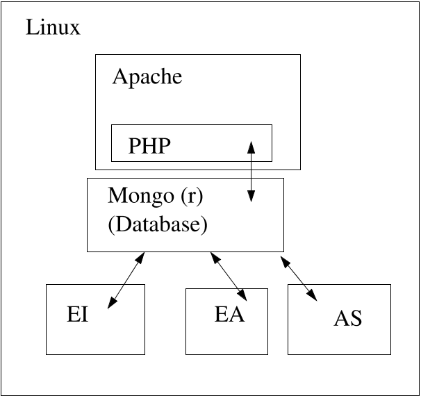

```{r options, include=FALSE}
options(rmarkdown.html_vignette.check_title = FALSE)
```

# Introduction


In the four process architecture [@Proc4], the presentation process often
has real-time constraints. In an adaptive system, it is unacceptable for
the subject to wait for more than a few moments for the presentation
process to load the next task. Similarly, information about subject
performance should be returned quickly to the presentation process to
avoid annoying delays. However, there is considerable uncertainty about
how long the evidence identification (EI), evidence accumulation (EA)
and activity selection (AS) will take to run.

The _Dongle_ is a lightweight adapter between the presentation process
and the other three processes consisting of a database, a web server and
a number of PHP scripts. When the presentation process needs information
from one of the other processes, it sends an HTTP POST message to the
appropriate script. The script fetches the appropriate record for the
given user and application from the database and returns it as a JSON
document. The other processes, when they complete their work, update the
records in the database. If the EI, EA or AS processing is not completed
when the presentation process requests the information, the most recent
available information from the database is provided. This might be
slightly out of date, but this is often better than waiting. If no
record is a available for a given user, a default record for that
application is returned. In this way the dongle process is as fast as
the load on the web server and network latency allows.

Figure \@ref(fig:P4Lamp) shows the basic architecture. At its heart, it is
a modified LAMP (Linux, Apache, Mongo,[^1] PHP stack. The game engine
communicates to the other processes through HTTP requests to the web
server, and the other three processes (EI—evidence identification,
EA—evidence accumulation, and AS—activity selection) communicate through
the database.

```{r P4Lamp, fig.cap="Proc4 Dongle Architecture", out.height="25%", echo=FALSE}

```

# Proc4 Message Format {#sect:P4Messages}

The Proc4 message is an object consisting of two parts: a header and a
body. The header is a series of mandatory and optional fields which are
used to route and prioritize the message. The data portion is a
container object which can hold anything. In general, its value will be
determined by the message. Example \@ref(exm:P4) shows the data structure
in JSON format.


::: {.example #P4 "Sample Message in P4 format"}
```{example, fig.cap="(ex:P4) Sample message in P4 format", eval=FALSE}
{
    app: "ecd://epls.coe.fsu.edu/PP",
    uid: "Student 1",
    context: "SpiderWeb",
    sender: "Evidence Identification",
    mess: "Task Observables",
    timestamp: "2018-10-22 18:30:43 EDT",
    processed: false,
    data:{
        trophy: "gold",
        solved: true,
        objects: 10,
        agents: ["ramp","ramp","springboard"],
        solutionTime: {time:62.25, units:"secs"}
    }
}
```
:::

The fields have the following definition


* `app`:  (String, Required). A globally unique identifier (guid) for the
    assessment application. This should have a URL-like syntax with the
    first header corresponding to the domain of the organization issuing
    the ID.

* `uid`:  (String, Required). A unique identifier for the student or player.
    Note that administrative messages which correspond to all players
    could have an empty string as a value.

* `context`: (String, Required) A unique identifier for the context in
    which the message was generated. In *Physics Playground* this
    corresponds to game levels, but it might have other meanings in
    other applications.

* `sender`: (String, Optional). An identifier for the process which generated
    the message.

* `mess`:  (String, Required). An identifier for the contents of the
    message.

* `timestamp`: (String in POSIX format, Required). A timestamp for the
    message. Generally, messages for the same `uid` need to be processed in
    chronological order.

* `processed`: (Boolean, Optional). A flag that can be set after the
    message has been processed.

* `error`:(Any, Optional). If an error occurs during the processing of the
    message, details can be placed here.

* `data`:   (Any, Required). The contents of the message. The expected content
    and format is controlled by the application and vocabulary.

Note that this P4 Message class can be extended with additional header
fields. For example, Evidence Identification messages add `object` and
`verb` fields. 

The `app` field plays a special role in defining the *vocabulary* for the
assessment. In particular, the application defines the legal values for
the `context`, `mess` and `sender` can take, as well as the expected
structure of the for various values of `data`.

The dongle process uses a document-orient database Mongo (R)
[@Mongo]. This allows indexes to be built for the header fields, while
allowing the data fields to be 
unrestricted. The database serves as a buffer between the game process,
communicating through the web server, and EI, EA and AS processes
communicating directly with the database.

# Mongo Database Schemas {#sect:Mongo}


There are four database collections in the Proc4 database:
`AuthorizedApps`, `Players`, `Statistics`, and `Activities`.
The latter three provide mechanisms for the EI, EA and AS processes
respectively to communicate with the game engines. When queried, all
three will return the record (or the latest record) matching the
provided `app` and `uid`. If no record is available with those ids,
then a special default record for that application, with
`uid="DEFAULT"`, will be returned. 

The configuration resides in two places. The file
`/usr/local/share/Proc4/Proc4.js` contains
initialization codes (note, the instructions assume that the system is
Unix or Linux; on a Windows machine, a suitable replacement for the
`/usr/local/share/Proc4` configuration directory should be chosen). In
particular, it contains both the definition of 
the authorized applications, and the credentials for the various
databases (if secure login is enabled). The script file
`setupDatabases.js` sets up the security for the four processes (in
the `Proc4`, `EIRecords`, `EARecords` and `ASRecords` databases), and
sets up the collections and indexes in the `Proc4` database. Most of
the code in is described below. These files are located in the `r
system.file("config",package="Proc4")` directory (or `inst/config` in
the source package) of the R package. They can be run with the shell 
command `mongo` _script_`.jpg`.

## AuthorizedApps Collection


The `AuthorizedApps` collection has two purposes: to provide as a
first line security and to provide for a graceful shutdown of the EI,
EA and AS processes. The security is somewhat minimal, it is just that
a message with an `app` field that does not match one of the
`AuthorizedApps` records will return an error. While this 
will not stop a determined attacker, it will make it harder for a hacker
randomly looking for open ports to get data from the database. The
second is related to the field of the record. The EI, EA, and AS
processes periodically check this, and if it is false, then they shut
down gracefully.

This collection was never give an formal schema.
Example \@ref(lst:AuthorizedApps) shows the code that creates it. The
`app` and `active` fields should be counted as required and as
recommended. 

```{example, fig.cap="(lst:AuthorizedApps) Mongo script to create AuthorizedApps collection.", eval=FALSE}
// In Proc4.js configuration file.
var apps = [
    {"app":"ecd://epls.coe.fsu.edu/P4test","doc":"Testing",
     "active":true},
    {"app":"ecd://epls.coe.fsu.edu/PhysicsPlayground/userControl",
     "doc":"User Controlled (Spring 2019)","active":true},
    {"app":"ecd://epls.coe.fsu.edu/PhysicsPlayground/linear",
     "doc":"linear (Spring 2019)","active":true},
    {"app":"ecd://epls.coe.fsu.edu/PhysicsPlayground/adaptive",
     "doc":"adaptive (Spring 2019)","active":true}
];
// In setupProc4.js setup file.
apps.forEach(function (row) {
    db.AuthorizedApps.replaceOne({"app":row.app},row,
								 {"upsert":true});
});
```


This fields is mostly manipulated with raw database commands setting the
`active` field. The launch scripts for the EI and EA processes both
set the field `active` to true. (They will also, if necessary, add a
record for the application.) To signal a graceful shutdown, simply set
the field to false. Example \@ref(lst:shutdown) gives some example
syntaxes (to run from the mongo command shell).

```{example, fig.cap=="(lst:shutdown) Mongo scripts to signal processes to shutdown", eval=FALSE}
// Shutdown just the P4test engine
db.AuthorizedApps.update({app:{"$regex":"P4test"}},
						 {"$set":{active:false}});
// Shutdown all active apps
db.AuthorizedApps.update({active:true},
						 {"$set":{active:false}});
```

The graceful shutdown causes the process to process all remaining events
in the queue and then stop. It became obvious that there was a need of a
rapid shutdown as well. In particular, there were cases where the
processes should be shut down after finishing processing the current
event so that repairs could take place before continuing. A future
version of the code should have this.

## Players Collection


The original purpose of the `Players` collection was to notify the
other processes about which players were currently active in the game,
and which were not. As the game engine would send a message to the
scoring server when the players logged in, the `data` field of the
collection was used to store information about the player which needed
to persist between game sessions; in particular, the player’s bank
balance and the , a list of completed levels with the coin awarded for
each. Example \@ref(lst:Players) gives the schema for this collection.

```{example, eval=FALSE, fig.cap="(lst:Players)  Players collection schema definition"}
db.createCollection("Players", {
    validator: {
        \$jsonSchema: {
            bsonType: "object",
            required: ["app","uid","active","timestamp"],
            properties: {
                app: {
                    bsonType: "string",
                    description: "Application ID (string)"
                },
                uid: {
                    bsonType: "string",
                    description: "User (student) ID (string)"
                },
                active: {
                    bsonType: "bool",
                    description: "Is the player currently active?"
                },
                context: {
                    bsonType: "string",
                    description: "Context (task) ID (string)"
                },
                timestamp: {
                    bsonType: "date",
                    description: "Timestamp"
                },
                data: {
                    bsonType: "object",
                    description: "Player State information passed to game engine at login."
                }
            }
        }
    },
    validationAction: "warn"
});
db.Players.createIndex( { app:1, uid: 1});
```

Note that this is a subset of the basic `Proc4` message
format. The `active` field should be set to true when the player
starts play, and to false when the player stops. 
The PHP scripts `PlayerStart.php` and `PlayerStop.php` start and stop
the player. Note that current the 
game may or may not post a message to the script. Currently, the other
processes are not relying on this, but this needs to be revisited later
if it becomes important.

In addition to setting the active field, the `PlayerStart.php` script
returns the current value of the `data` field as part of a
message.  For the _Physics Playground_ implementation, `data` is a
named list (or dictionary) with two elements: `backBalance` and
`trophyHall`. The first in an integer value giving the players’ bank
balance (as of the last event processed), and `trophyHall` is a named
list with the names corresponding to levels and the values 
corresponding to coins (“gold” or “silver”). Levels for which a coin was
not awarded do not appear in the list.

The EI process is responsible for keeping the `Players` collection up
to date. There is a special collection of rules called
`TrophyHallRule.json` which contain the logic
for doing the update. These include special trigger rules which run to
update the `Players` collection; and a special listener which listens
for those messages.

## Statistics Collection


The EA process, in response to each release of observables from the EI
process, performs the following actions: (1) it fetches the student
model for the reference `uid`, (2) it updates the student model using the new
evidence, (3) it updates a list of `statistics` for the updated
student model, (4) it posts the updated statistics so they can be
viewed both other processes. 
One of the places it posts the updated statistics is in the
`Statistics` collection in the database. Example \@ref(lst:Statistics)
provides the schema for that collection.

```{example, fig.cap="(lst:Statistics) Mongo script to create Statistics collection and indexes.", eval=FALSE}
db.createCollection("Statistics", {
    validator: {
        \$jsonSchema: {
            bsonType: "object",
            required: ["app","uid","timestamp"],
            properties: {
                app: {
                    bsonType: "string",
                    description: "Application ID (string)"
                },
                uid: {
                    bsonType: "string",
                    description: "User (student) ID (string)"
                },
                context: {
                    bsonType: "string",
                    description: "Context (task) ID (string)"
                },
                sender: {
                    bsonType: "string",
                    description: "Who posted this message."
                },
                mess: {
                    bsonType: "string",
                    description: "Topic of message"
                },
                timestamp: {
                    bsonType: "date",
                    description: "Timestamp"
                },
                data: {
                    bsonType: "object",
                    description: "Named list of statistics."
                }
            }
        }
    },
    validationAction: "warn"
});
db.Statistics.createIndex( { app:1, uid: 1, timestamp: -1});
```

The EA process updates the `data` field of the record for the just processed
student. The value of the `data` field is a named list of statistics. The value
of the statistic depends on the specifications given to the EA process.
There are three common kinds of statistics that are used: real-valued
statistics (for example the expected a posteriori or EAP statistic),
string valued statistics (for example, the mode or median of a Bayes net
node), and vector valued statistics (for example, the probability
distribution for a node).

The script `PlayerStats.php` returns the current record in the
`Statistics` collection for the player. 

## Activities Collection


The last collection was never actually implemented, but it was created
for future expansion. Example \@ref(lst:Activities) provides its draft
schema. Its purpose was to provide a place the AS could post messages
about which level to provide next. The script `PlayerLevel.php` would
return its current value.

```{example, fig.cap="(lst:Activities) Mongo script to create Activities collection and indexes.", eval=FALSE}
db.createCollection("Activities", {
    validator: {
        \$jsonSchema: {
            bsonType: "object",
            required: ["app","uid","timestamp"],
            properties: {
                app: {
                    bsonType: "string",
                    description: "Application ID (string)"
                },
                uid: {
                    bsonType: "string",
                    description: "User (student) ID (string)"
                },
                context: {
                    bsonType: "string",
                    description: "Context (task) ID (string)"
                },
                sender: {
                    bsonType: "string",
                    description: "Who posted this message."
                },
                mess: {
                    bsonType: "string",
                    description: "Topic of Message"
                },
                timestamp: {
                    bsonType: "date",
                    description: "Timestamp"
                },
                data: {
                    bsonType: "object",
                    description: "Data about Activity Selection."
                }
            }
        }
    },
    validationAction: "warn"
});
db.Activity.createIndex( { app:1, uid: 1, timestamp: -1});
```

Although this was not implemented, the following notes describe the
planned design. The data field would contain four components: `topic`,
`completeLevels`, `availableLevels`, and `supportMode`. Topic is
intended as a string valued field. The game levels would be 
divided into a number of *topics*. When the internal criteria in the AS
algorithm were met, the player would “graduate” from the topic, and the
value of the topic field would change. The components
`completedLevels` and `availableLevels` would list all
of the levels in the topic. The `availableLevels` would be sorted into
the desired order. As levels were completed, they would be moved to
the `completedLevels` field. The `supportMode` component is a logical
variable that would be set if the player should 
be placed into a learning support rather than the game at the start of a
new level.

The design of the `Activities` collection is designed to be robust
against latency problems with the EI, EA and AS processes. In order to
for the algorithm to be completely adaptive, then all three processes
must complete between the time the player finishes the game level and
the system requests a new game level. If this condition does not hold,
the database can return the sorted list of levels, taking the just
completed level from the list of available levels and putting it on
the completed list.  So although the next level played may not be
completely optimal, as long as the EI, EA and AS processes don’t fall
too far behind it will be at least close to optimal.

# PHP communication Layer {#sect:PHP}


A number of PHP scripts are provided to allow the game engine (or other
process) to access the information in the database. The PHP scripts
always return the most recent information available for the player, or
if no information is available for the player, a default record is
returned. In particular, this means that the processes should never
block, but they might not return the most recent information if there
are still unprocessed events working their way through the EI, EA and AS
processes.

All of the PHP scripts expect the headers in the basic P4 Message format
using fields of an HTTP POST request. In particular, it is looking for
fields of with the names "app", "uid", "context", "sender", "mess",
"timestamp", and "data". If accessed using the post method, all of the
pages should return a file of type ’application/json’ in utf-8 encoding.
If the php scripts are accessed using a GET rather than a POST request,
then a HTML form with these fields is returned (to be used for testing).

There are four primary files which are used for the communication:

* `PlayerStart.php`:  Called when player logs in on a given day. As
    data returns information needed to restore gaming session
    (currently bank balance and list of trophies earned). Note that
    player details are updated by the EI process.

* `PlayerStop.php`: Called when player logs out. Currently not
    used. It is designed to help automatically shut down unneeded
    processed.

* `PlayerStats.php`:   Called when current player competency estimates
    are required, e.g., when displaying player scores. It returns a
    list of statistics and their values in the data field; the exact
    statistics returned depend on the configuration of the EA
    process. This database collection is updated by the EA process
    after each game level is processed.

* `PlayerLevels.php`: Called when the game wants the next level. The
    message data should contain information about what topic the
    player is currently addressing and a list of played and unplayed
    levels, with the unplayed levels sorted so the next level
    according to protocol is first on the list. The complete list of
    levels should be returned so that if levels on the list have
    already been completed, a new level would be entered. Although the
    PHP script has been built, the AS process to feed it has not.

In addition to the primary files there are some auxiliary files that are
available as well.

* `P4echo.php`: This script simply repeats back the message that was
    sent as a json object. Intended for testing.

* `Proc4.ini`: This contains configuration information used by the
    other processes, particularly, database credentials and a list of
    supported application names. A template file is provided in the
    directory. It should be edited and moved to (or other designated
    configuration directory).

* `config.php`: This script is called by the others, it is mainly
    calls the script, so this file can be modified if that script is
    in a non-standard location.

* `composer.json`: This file is generated by composer to get mongo to
  install.

The configuration file contains a list of application IDs and the
passwords for the databases. The file is shown in
Example \@ref(lst:Proc4ini). The applications are particularly important
as they serve as a password for systems that use this facility. In
particular, unless the `app` field of the POST request is one of the
applications listed in the ini file, then the scripts will return an
error. This should prevent random hacking, but more serious security
might be needed if there is a more substantial risk.

```{example, fig.cap="(lst:Proc4ini) Proc4.ini -- PHP-style parameter file.", eval=FALSE}
test = "ecd://epls.coe.fsu.edu/P4test"
userControl = "ecd://epls.coe.fsu.edu/PhysicsPlayground/userControl"
linear = "ecd://epls.coe.fsu.edu/PhysicsPlayground/linear"
adaptive = "ecd://epls.coe.fsu.edu/PhysicsPlayground/adaptive"

[users]
EIP = "secret"
EAP = "secret"
ASP = "secret"
C4 = "secret"
```

Installation requires the following steps:

1.  Edit the `Proc4.ini` file (in the `config` subdirectory of the
    package) and move it to the configuration directory, by default
    `/usr/local/share/Proc4`. 

2.  Edit the `config.php` file if necessary and copy the php scripts
    to a directory exposed by the web server.

3.  Install the mongo PHP drivers using PECL and composer. See the
    instructions at <https://docs.mongodb.com/ecosystem/drivers/php/>.
    (Note for RHEL. Because RHEL 7.5 is behind the curve on a large
    number of packages, the available drivers for RHEL have lower
    version numbers. You may need to remove the file. The dongle appears
    to work fine with version 1.1 of mongodb, which is what I get with
    RHEL 7.5.)

# Pulling statements from the learning record store. {#sect:Loop}


Learning Locker stores events as `xAPI` [@xAPI] formatted JSON in a
collection called `statements` in a database called `gameLRS` (or at
least that is the setup for *Physics Playground*). All of the
statements have a timestamp, so the extraction loop can get only new
messages after the first extraction. The scripts `extractEvidence.sh`
and `importEvidence.sh` facilitate the extraction from learning locker
and the upload into the `EIRecords` database.

Between extraction and importation, the messages must be converted
from xAPI (actually a wrapped xAPI format) to P4 format. This is done
by the bash script `LLtoP4` (Example \@ref(lst:LLtoP4)). The translation
is done in three steps. The first step, using the program `jq`
(<https://stedolan.github.io/jq/>), extracts the fields relevant for
the P4 messages from the unused information in the wrapped xAPI
schema. Note that much of the useful information as defined in is in
the extension for the object element of the statement. The second step
uses standard GNU tool sed (Windows users, see
<http://gnuwin32.sourceforge.net/packages/sed.htm>) to shorten long
URL-like guids to shorter keywords. The third step promotes some
information (in particular, the `app` and `context` fields) which are in the
extensions to the header.

```{bash, fig.cap="(lst:LLtoP4) Learning Locker to P4 JSON conversion script", eval=FALSE}
#!/bin/bash
jq -f filter1.jq | sed -f filter2.sed | jq -f filter3.jq
```
In theory, simply looping the shell command, `extractEvidence.sh
`_date_` | LLtoP4 | importEvidence.sh`, is all that is necessary.
In practice, two additional steps are needed. First, it is necessary to
extract the most recent timestamp from the downloaded file. The next
extraction will be for all events after that timestamp. Second, it is
often useful to filter the events before uploading them to the database.

Adding an extra filtering step to the extraction loop is a big time
saver, as events which will not trigger any evidence rules can simply be
discarded. The filter `jq -f coreEvents.jq` is used to delete events
which will not trigger rules. The result was about a 500-fold
reduction in work required for the operational version of *Physics
Playground*. 

To allow for a graceful shutdown, the loop is given a name (the first
argument to the shell script) and a file
`/usr/local/share/Proc4/log/`_name_`.running` is created when the script
starts. In every loop, that file is checked. If it no longer exists, the
script exits. So the loop can be shut down by removing the file. (The
script is typically started using so that it runs as background
process.) Example \@ref(lst:LLtoP4Loop) shows the listing.

```{bash, fig.cap="(lst:LLtoP4Loop) Shell process for transfering LL events to EI input queue.", eval=FALSE}
#!/bin/bash
IP=127.0.0.1
name=$1
starttime=$2
echo "Learning Locker to P4 extraction loop, $1, starting: $2"
## Create a running file, when this file is deleted, 
## the process will stop.
cd /usr/local/share/Proc4/bin
touch ../logs/$name.running

cache1=$(mktemp --tmpdir ${name}.XXXXXXXXXX)
cache2=$(mktemp --tmpdir ${name}.XXXXXXXXXX)

while [ -f ../logs/$name.running ]
do
    ssh $IP ./extractEvidence.sh $starttime >$cache1
    if [ $(tail -n +2 $cache1 | jq 'length') -gt 0 ]; then
        tail -n +2 <$cache1 | ./LLtoP4 | jq -f coreEvents.jq >$cache2
        ./importEvidence.sh <$cache2
        starttime=$(jq '[.[]|.timestamp."$date"]|max' $cache2)
    fi
    echo "Next extraction at $starttime"
    sleep 10s
done
```

## Configuration {#sect:config}


This manual assumes that a modify LAMP (Linux, Apache, Mongo, PHP) stack
is configured on the target machine. (Sorry, Windows users, a fair
amount of adaptation will be needed to run under Windows.) Refer to the
help files for your Linux distribution and Mongo to accomplish this
task. Also, for the Proc4 for R library will need to be
installed on the target system.

## Configuration Files

The first step is to pick a configuration directory for Proc4. The
current system assumes that the configuration directory is
`/usr/local/share/Proc4`, but this could be changed depending on local
preferences. This directory will need to be created with root
privileges, but can then be set as writable by a normal user
account. For brevity, this configuration directory will be simply
called `Proc4` in the sequel.  Note that the location of the directory
is hard coded into a number of files, and they will need to be
manually edited if a different location is chosen. 

Create two subdirectories `bin` and `logs` underneath the
`Proc4` configuration directory. (The log directory could be a symlink to a
directory on another partition if space on the root partition is at a
premium). 

Note that in the current implementation, two other directories are
placed in the `Proc4` directory, `PP-EI` and `PP-EA`
which contain the scoring models for the `EIEvent` (EI) and `EABN` (EA)
processes.  These are tied to github repositories, so that the scoring
models can be updated by checking the updated models into the proper
github branch.  In particular, different branches can be used for
variations in the basic scoring model.

Finally, there are a number of configuration files that are stored in
the R package tarball. These can be accessed in one of two
ways. First, install the R package, then use the command
`library(help=`Proc4`)\$path` to determine the install location for
the R package. The `config` and `dongle` subdirectories are in that
location. The alternative is to simply unpack the Proc4 tarball in
some known location (equivalently, one could download from github in a
given location). The subdirectories `inst/config` and `inst/dongle`
contain the relevant files. 

Copy the files `config/Proc4.js` and `config/Proc4.ini` to the
`Proc4` directory. These files will need to be edited
to reflect the local configuration. In particular, if database
passwords are used, then they will need to be set in this file. Also,
`Proc4.ini` has a list of valid applications. The EI, EA and AS
processes will also store their initialization files in this
directory.

# Mongo Configuration


Using the mongo database, both security (user IDs and passwords) is
optional. Running mongo without security turned on is probably okay as
long as the installation is (a) behind a firewall, and (b) the firewall
is configured to not allow connections on the mongo port except from
localhost. However, other users may want to turn on security.

The recommended security setup is to create four users, “EIP”, “EAP”,
“ASP”, and “C4” for the four processes and to assign a password to each.
The URI’s of the database connections then need to be modified to
include the username and passwords. Each process would have an file
which contains its password which is stored in an appropriate
configuration directory.

The files `Proc4/Proc4.ini` (PHP format) and `Proc4/Proc4.js`
(javascript format) are used for saving the 
key usernames and passwords. Note that the mongo configuration files
read the usernames and passwords from `Proc4/Proc4.js`, so this file
needs to be configured before the running the database setup scripts
below. 

The file `setupDatabases.js` in the `config` directory creates
databases for each of the processes and stores the appropriate login
credentials. This is a javascript file designed to be run directly in
mongo, i.e., `mongo setupDatabases.js`. Note that it must be run 
by a user which has the appropriate privileges to create databases and
modify their security (a "root" user). This step is required if security
is turned on in the database, and optional if it is turned off.

The file `config/setupProc4.js` sets up schemas and indexes for
collections in the `Proc4` database which are used by the dongle
process. Schemas are optional in mongo, but the indexes should speed
up operations. 

# PHP Dongle Configuration


To create the dongle process, pick a directory under apache control
(e.g., a subdirectory of `http_docs`) in which to install the
Dongle. This will determine the URL base for the dongle scripts. Next,
copy all of the PHP files and the file `composer.json` from the `dongle`
directory to the web directory. If the `Proc4` directory is not at
'/usr/local/share/Proc4', then file `config.php` should be edited to 
reflect the proper path.

The file `Proc4/Proc4.ini` will need to be edited (a) to ensure the
proper passwords are in place for the processes and (b) to list all of
the legal applications in the section. Note that the scripts use the
field to verify that the requester is actually associated with the project.

Ensure that the mongodb extensions for PHP have been installed
(<https://docs.mongodb.com/ecosystem/drivers/php/>). Note that the last
step is to run `composer` in the URL base directory for the
dongle. (The supplied `composer.json` file was generated using Ubuntu
18.04. Under RHEL 7.5, an earlier version of the mongodb extension is
needed. To install under RHEL, delete `composer.json` and install
using `composer require mongodb/mongodb`.

The file `P4echo.php` can be used for testing the
configuration. Simply point the browser at the file, and it will give
you a form for sending a test message, which it will echo back. The
other scripts work in a similar way, issuing a GET request (i.e.,
pointing a browser at the page) will return a form that can be used to
POST a test message and return the JSON message. This may not be
particularly useful until the databases have been populated though.

## Event Loop Configuration

The remaining files (i.e., everything but the `php` files) in the
`dongle` directory are for the event loop. These should be copied to
`Proc4/bin`. Many of the shell  scripts assume the location of the
filter files (with `.jq` and `.sed` extensions) in the local
directory, so the `LLtoP4Loop` command needs to be edited to run in this
directory.

In the *Physics Playground* implementation learning locker and `Proc4`
were run on different servers. To implement this, the IP address in
`LLtoP4loop` needs to be updated to the name or IP address of the
learning locker server. The file `extractEvidence.sh` also needs to be
copied to the learning locker server and put in the login
directory. The script uses an ssh tunnel to do 
the extraction; so this connection (both firewalls and ssh keys) needs
to be properly configured.

Finally, the file `Proc4/bin/coreEvent.jq` determines which events are
imported into the EI process queue. This will need editing depending
on the rule set used by the EI process.

# Acknowledgements


Work on the Proc4, EIEvent and EABN packages has been supported by the
National Science foundation grants *DIP: Game-based Assessment and
Support of STEM-related Competencies* (\#1628937, Val Shute, PI) and
*Mathematical Learning via Architectual Design and Modeling Using
E-Rebuild.* (\#1720533, Fengfeng Ke, PI).

The Proc4 package developement was led by Russell Almond (Co-PI).

[^1]: The modification is that the Mongo database is substituted for the
    MySQL database used in many web applications.
